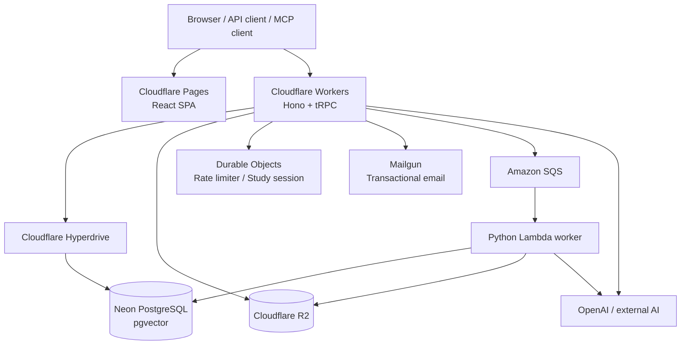
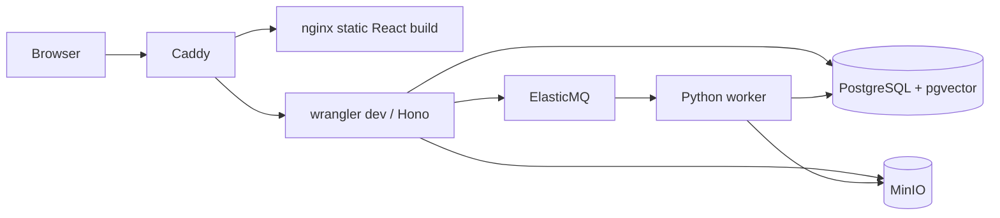

# システム構成図

## 本番

```mermaid
flowchart TB
    User[Browser / API client / MCP client]
    Pages[Cloudflare Pages<br/>React SPA]
    API[Cloudflare Workers<br/>Hono + tRPC]
    HD[Cloudflare Hyperdrive]
    Neon[(Neon PostgreSQL<br/>pgvector)]
    R2[(Cloudflare R2)]
    DO[Durable Objects<br/>Rate limiter / Study session]
    Email[Mailgun<br/>Transactional email]
    SQS[Amazon SQS]
    Lambda[Python Lambda worker]
    AI[OpenAI / external AI]

    User --> Pages
    User --> API
    API --> HD --> Neon
    API --> R2
    API --> DO
    API --> Email
    API --> SQS --> Lambda
    Lambda --> Neon
    Lambda --> R2
    API --> AI
    Lambda --> AI
```

## ローカル

```mermaid
flowchart LR
    Browser --> Caddy
    Caddy --> Web[nginx static React build]
    Caddy --> API[wrangler dev / Hono]
    API --> Postgres[(PostgreSQL + pgvector)]
    API --> MinIO[(MinIO)]
    API --> ElasticMQ[ElasticMQ]
    ElasticMQ --> Worker[Python worker]
    Worker --> Postgres
    Worker --> MinIO
```

`docker compose up --build -d` で上記を起動します。UI の HMR は
`docker compose --profile dev up -d web-dev` で追加します。

## セキュリティ境界

- browser session: Better Auth の HttpOnly cookie session
- MCP integration: hash 保存された `vq_...` API key、またはOAuth 2.1
- OAuth client: PKCE、resource audienceに束縛したJWT access token、refresh token
- user secret: AES-256-GCM
- DB: Worker から Hyperdrive 経由
- object storage: 署名 URL または認可済み API stream
- rate limit / study session: Durable Objects
- transactional email: Mailgun

## 外部タスクとDBアクセス

ジョブ配送・招待メール・ストレージ削除はDBの `external_tasks` に保存し、通常は
即時実行、5分ごとのCronで再試行します。Cronは実行直前に1件ずつ取得します。
取得時に増加する `attempts` を所有者の識別に使い、完了・失敗・容量返却・招待の
更新では、有効なロックと試行番号を照合します。古い実行者は新しい実行者の状態を
上書きできません。同一実行で試行したタスクIDは次の取得から除外し、処理が
長引いて再試行時刻を過ぎても同じタスクを繰り返しません。

外部サービスへの送信とDB更新は単一トランザクションにはできません。配送自体は
at-least-onceで、SQSのジョブ実行はPython側の `job_executions` でも重複を防ぎます。

DBクライアントはリクエストをまたいで共有しません。タグ更新の所有確認・更新・
再取得は1接続のトランザクションで実行し、メディアのファイル特定と認可は
1つのSQLで確認します。
