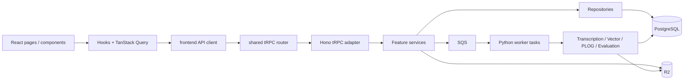
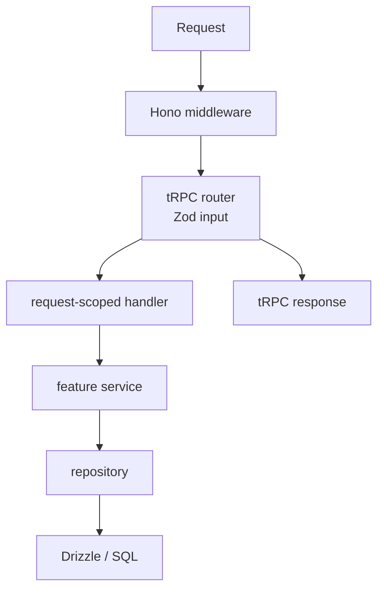
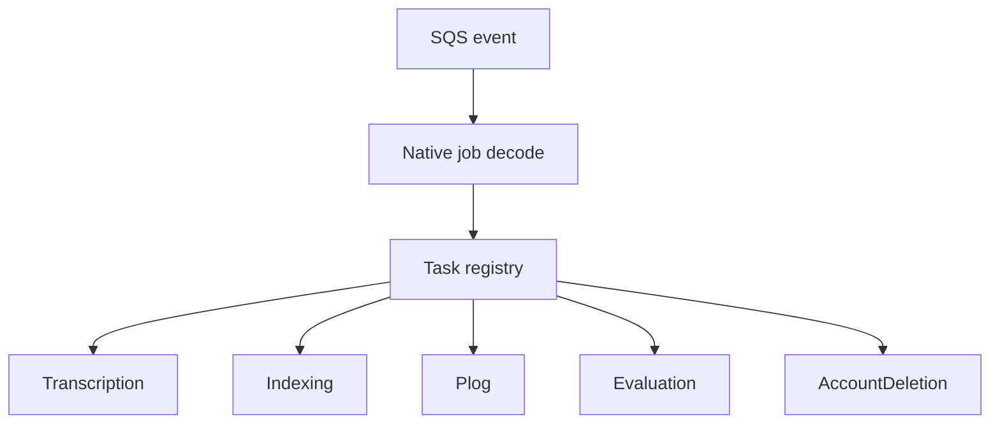

# コンポーネント図

## 全体

```mermaid
flowchart LR
    UI[React pages / components] --> Hooks[Hooks + TanStack Query]
    Hooks --> Client[frontend API client]
    Client --> Contract[shared tRPC router]
    Contract --> Adapter[Hono tRPC adapter]
    Adapter --> Services[Feature services]
    Services --> Repositories[Repositories]
    Repositories --> DB[(PostgreSQL)]
    Services --> R2[(R2)]
    Services --> SQS[SQS]
    SQS --> Tasks[Python worker tasks]
    Tasks --> Pipelines[Transcription / Vector / PLOG / Evaluation]
    Pipelines --> DB
    Pipelines --> R2
```

## API feature

通常の JSON API は共有 tRPC router と API adapter を通ります。

```mermaid
flowchart TD
    Request --> Hono[Hono middleware]
    Hono --> Router[tRPC router<br/>Zod input]
    Router --> Adapter[request-scoped handler]
    Adapter --> Service[feature service]
    Service --> Repository[repository]
    Repository --> Drizzle[Drizzle / SQL]
    Router --> Response[tRPC response]
```

主な feature:

- auth
- videos / courses / tags
- chat / evaluation / plog
- oauth / mcp
- membership / media
- health

OAuth、webhook、SSE、multipart、CSV、media binary、OpenAI 互換 API は
HTTP protocol 固有のため Hono route として分離します。

## Worker

```mermaid
flowchart TD
    Event[SQS event] --> Decode[Native job decode]
    Decode --> Registry[Task registry]
    Registry --> Transcription
    Registry --> Indexing
    Registry --> Plog
    Registry --> Evaluation
    Registry --> AccountDeletion
```

HTTP の責務は API、CPU・時間を要する処理は worker に分離します。
